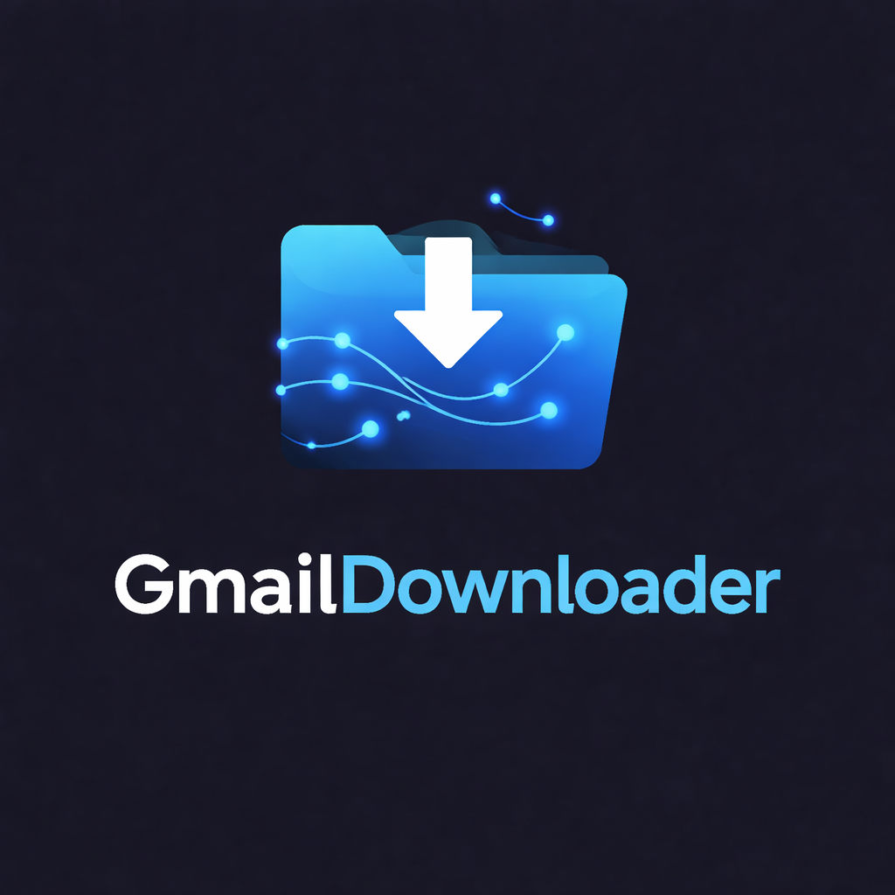

<!-- codex-branding:start -->
<p align="center"></p>

<p align="center">
  
  
  
</p>
<!-- codex-branding:end -->

# GmailDownloader

  

Full Gmail mailbox downloader, AI-powered organizer, and analytics suite. Download your entire Gmail as `.eml` files, auto-categorize with 150+ domain mappings and Claude AI, then organize locally — without ever modifying your live mailbox.

## Features

### Core
- **Full Mailbox Download** — Downloads all Gmail folders (Inbox, Sent, Drafts, Starred, custom labels) as `.eml` files with original folder structure preserved
- **Resumable Downloads** — Stop anytime, resume later. Manifest tracks every downloaded email per folder
- **Message-ID Deduplication** — Same email across multiple Gmail labels stored once on disk
- **AI Categorization** — 150+ known domain mappings, `List-Unsubscribe` newsletter detection, subject pattern matching, and Claude Haiku for ambiguous emails
- **Dual Execute Mode** — Organize local files (safe, no mailbox changes) or apply Gmail labels (modifies live mailbox)
- **Feedback Loop** — Every manual recategorization teaches the engine. Learned rules persist across sessions and apply first on future runs

### Analytics
- **Statistics Dashboard** — Emails per month, activity heatmap (day x hour), top senders/domains, category distribution, storage breakdown
- **Group-by Views** — Instantly regroup the tree view by Category, Sender Domain, Sender, or Source Folder

### Subscription Management
- **Subscription Scanner** — Detects newsletters via `List-Unsubscribe` header + 25+ newsletter platform domains (Mailchimp, SendGrid, Substack, etc.)
- **One-Click Unsubscribe** — Opens unsubscribe URL directly in your browser
- **Frequency Analysis** — Shows daily/weekly/monthly/irregular send patterns per subscription

### Power Tools
- **Auto Clean Rules** — Persistent rules engine (domain, sender, subject, age, newsletter flag) with CRUD editor
- **Gmail Filter Import** — Parse Gmail's filter export XML into GmailDownloader rules
- **Attachment Extraction** — Pulls all attachments from `.eml` files, deduplicates by SHA-256, organizes by category
- **Sensitive Content Scanner** — Detects SSNs, credit card numbers, passwords, API keys, and tokens in email bodies
- **Thread Summarization** — Reconstructs email threads via `In-Reply-To`/`References` headers, generates 2-3 sentence AI summaries
- **CSV/JSON Export** — Full metadata export (date, sender, subject, category, confidence, folder, size, newsletter flag, sensitive flags)

## Requirements

- Python 3.10+
- Gmail account with [App Password](https://myaccount.google.com/apppasswords) (requires 2-Step Verification)
- Optional: [Anthropic API key](https://console.anthropic.com) for AI classification and thread summarization

## Usage

```bash
python gmaildownloader.py
```

Dependencies (`PyQt6`, `anthropic`) are auto-installed on first run.

### Workflow

1. **Connect** — Enter Gmail address + App Password
2. **Download** — Choose a local folder. All Gmail folders download as `.eml` files with resume support
3. **Analyze** — Auto-categorizes all emails. View statistics dashboard
4. **Review** — Browse categories, rename/merge/delete, run AI classification, scan for sensitive content, extract attachments, manage subscriptions
5. **Execute** — Organize `.eml` files into categorized folders with readable filenames, or apply Gmail labels

### Output Structure

```
GmailDownloader/
├── folders/              # Original Gmail structure
│   ├── INBOX/
│   ├── Sent Mail/
│   ├── Drafts/
│   └── ...
├── organized/            # AI-categorized
│   ├── Shopping/
│   │   └── 2024-03-15_amazon.com_Your_order_shipped.eml
│   ├── Financial/
│   ├── Work/
│   │   └── Internal/
│   ├── Newsletters/
│   └── ...
├── attachments/          # Extracted & deduplicated
│   ├── Shopping/
│   └── ...
├── manifest.json         # Download resume tracking
├── learned_rules.json    # Feedback loop persistence
└── clean_rules.json      # Auto clean rules
```

## Tech Stack

- **GUI**: PyQt6 with Catppuccin Mocha dark theme
- **Email**: Python `imaplib` + `email` (stdlib)
- **AI**: Anthropic Claude Haiku (optional, for classification + thread summaries)
- **Charts**: Custom QPainter widgets (no external charting deps)

## License

MIT
